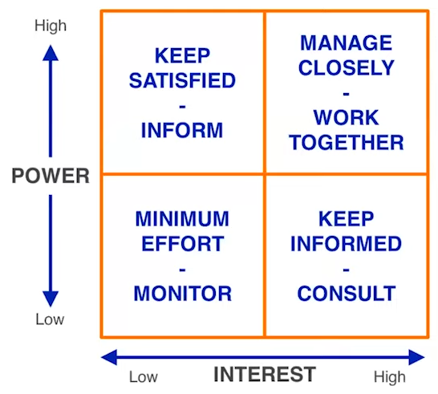

# [Improve Communication Skills at Work](https://www.youtube.com/watch?v=HAQ4p74KbdY)
By [Eugene Wang](https://www.linkedin.com/in/eugene-wang-494a3a1/)

## Scope and Objective

* Focus on daily communication at work
* Clarify the importance of effective communication at work
* Identify common barriers to effective communication.
* Define keys to effective communication.
* Provide some best practice and tips on how to improve communication skills.
* Q&A

## What are some of top communication needs at work? 

* Coordinate project execution with other team members on the same project.
* Request resource allocation from other stakeholders based on identified dependencies.
* Formally communicate project status.
* Ask for help!
* Escalation through the reporting chain to resolve a conflict.
* Continuous improvement of your domain knowledge and development of your career.

## Why is effective communication important?

* Defined: "Effective communication is more than just exchanging information. It's about understanding the emotion and intentions behind the information"
* Make informed decisions.
* Improves productivity.
* Build relationships.
* Manage stakeholder engagement.
* Provides visibility for you and your project.
* Resolves conflicts or settle disagreements.
* Communication style and effectiveness is usually an indicator of org culture.

## What's stopping you from communicating effectively? 

* Eager to get your point across without hearing what others have to say.
* Lack of confidence in your written and verbal communication skills.
* Lack of focus on the subject matter.
* Lack of ability to recognize an adopt specific aspects of communication style/standard at your work.
* Afrid of confrontation.
* Lack objectivity when receiving feedback (e.g. you take negative feedback personally)

## What are the key to effective communication? 

1. Know your audience.
2. Become an engaged listener.
3. Present information that is concise and precise.
4. Be candid and open.
5. Assert confidence and be receptive to feedback
6. Control your emotions.

## Do you know your audience?

Groups or individuals which you need to frequently communicate with include:
* Stakeholders directly involved on your project, e.g. product managers, designers, software developers, Legal, etc
* Peers in the same org as you, e.g. team members of other projects
* Superiors (immediate manager or 1-level up), e.g. your immediate manager, or managers from the same org.
* Executives, e.g. SVP or VP who is your project sponsor.
* Your formal and informal mentors

## Manage your stakeholders

## Tips to effective stakeholder engagement

* You are transparent about all relevant information (e.g. related to your project).
* You communicate with stakeholders in ways (e.g. emails, documents, etc) that work best for them.
* Do NOT judge what your stakeholders value, instead try to understand why.
* Provide feedback to stakeholders how their concerns or asks are addressed and resolved.
* Keep a record of all stakeholder communication that occur over time.

## Tips to become an engaged listener? 

* Stay focused while engaged, e.g. stay off your phones and laptops.
* Avoid interrupting the speaker or redirect the conversation. 
* Make eye contact.
* Mind your body language.
* Show interests, e.g. ask questions.
* Don't judge.
* Provide feedback.

## Tips to present concisely and precisely

* Think if you had just 3 minutes, what would you say? 
* 5 Ws - why, what, who, when, and where? 
* Answer a question directly, e.g. starts with "yes" or "no" before elaborating
* Focus on things that are impactful,. e.g. why is this information important? 
* Always include data, e.g. what's the expected business or customer impact? 
* Practice - if you bump into your VP in the pantry, and he says, "how's it going with...?", what would you say in 3 sentences? 

## Tips to effective written communication

| Component | Question | Example |
| --------- | -------- | ------- |
| Context | Why is this information relevant to me? | "as part of the broader effort to drive new user activation..." |
| Goals & Objectives | What are we trying to achieve? | Unlock a new customer cohort or expand share of wallet of an existing cohort. |
| Use case | What problem are we trying to solve? | Allow business users to purchase multiple copies of a digital eBook.
| Qualification and Quantification | Why is this problem important? | +xx% in total units of eBooks purchased (annualized).
| Proposed Solution | What are we going to do to address this problem? | Launch a new eBook purchase experience that allows bulk purchase of eBooks. |
| Success Measurements | How do we know that our solution worked or not? | Net increase to total eBook sales without net negative impact to eBook purchase conversion. |
| Priorities and Timelines | When are we going to do what? | MVP includes... |

## Tips to be candid and open

* Stick to facts, e.g. let metrics speak for themselves
* Assume best intentions, e.g. everyone wants the best experience for customers
* Get to the point, e.g. articulate a specific concern.
* Be objective, e.g. just because someone disagrees with you does NOT make them wrong!
* Be empathetic and don't kill the messenger, e.g. it takes a lot of courage for someone to bear unpleasant news.
* Collect feedback, e.g. ask for other opinions

## Tips to assert confidence

* Not afraid to disagree, e.g. learn to say no.
* Know your stuff, e.g. build up your subject matter expertise
* Speak with clarity, e.g. focus on the main point.
* Defend your point of view without being defensive, e.g. back up with data and anecdotal evidence.
* Own up to mistakes, e.g. no afraid to say you were wrong or you don't know.
* Seek feedback, e.g. welcome challenges
* Show respect, e.g. treat less senior team members with equal respect.

## Tips to control your emotions

* Have clear goals in mind, e.g. what are you trying to get out of a conversation or meeting? 
* Pause to collect your thoughts, e.g. don't feel that you need to rush into responding.
* Willing to compromise, e.g. finding a middle ground might be the path forward.
* Look for humor in a dire situation, e.g. don't take yourself or a topic too seriously.
* Agree to disagree, e.g. table a conversation that's not going anywhere to determine next course of action.

## Other tips to improve communication generally

* Learn to speak in public, e.g. there are ample resources available to help such as Toastmasters.
* Take professional or business writing classes to improve written communication.
* Prepare before an important meeting, e.g. write down key points on a piece of paper.
* Practice with your peers and friends, e.g. dry-runs before a formal presentation always helps.
* Write better emails, e.g. your manager and co-workers will recognize and appreciate it.
* Find mentors, e.g. use your formal and informal mentors for coaching and guidance.
